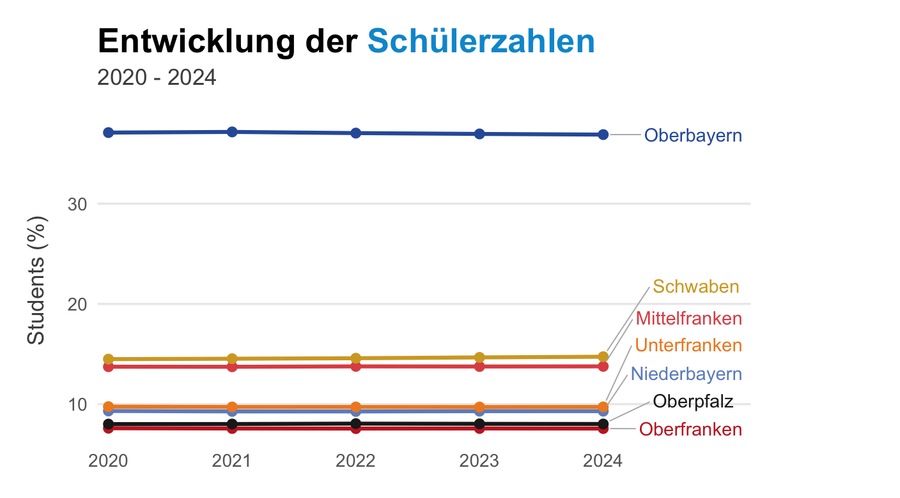

## Basic

A simple scatter plot.

```r
library(ggplot2)

ggplot(mtcars, aes(wt, mpg)) +
  geom_point()
```



## Colored

Color points by cylinder count.

```r
library(ggplot2)

ggplot(mtcars, aes(wt, mpg, color = factor(cyl))) +
  geom_point()
```


## Faceted

Split the plot by cylinder count.

```r
library(ggplot2)

ggplot(mtcars, aes(wt, mpg)) +
  geom_point() +
  facet_wrap(~cyl)
```


