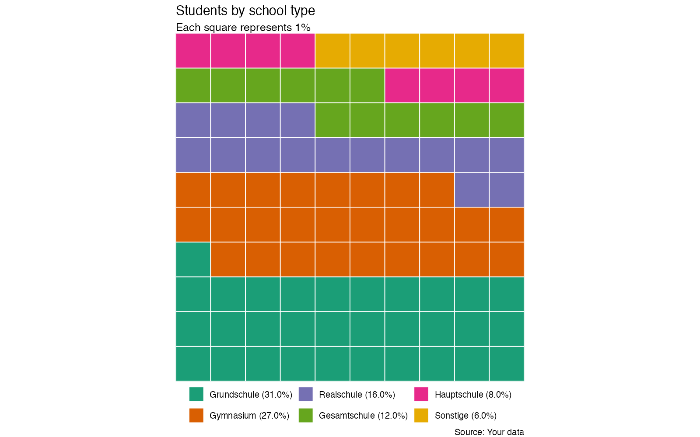

## Basic

A **waffle chart** displays a part-to-whole relationship using a grid of equally sized squares, with each square representing a fixed proportion of the total. By highlighting groups of squares with different colors, waffle charts make it easy to compare percentages and see how a population is distributed across categories.


The following plot uses a waffle chart to show *the number of pupils across different school types*. Each square represents a fixed number of pupils, while the different colors distinguish the school types. The chart provides a simple visual overview of how the pupils are distributed across the different types of schools.

```r
!r(waffle.R)
```


