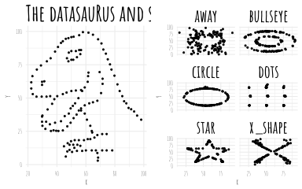
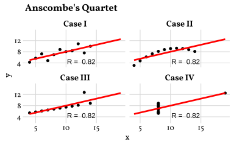

## Datasaurus

 Datasaurus is a dataset that shows how **summary statistics can hide the true structure of data**. It demonstrates that different datasets can have similar statistical properties but look completely different when visualized, highlighting the importance of **plotting data before drawing conclusions**. You can find more information on the **Datasaurus Dozen** on  Matejka and Fitzmaurice’s paper "Same Stats, Different Graphs: Generating Datasets with Varied Appearance and Identical Statistics through Simulated Annealing".


```r
sysfonts::font_add_google("Amatic SC", "Amatic+SC")
## Automatically use showtext to render text for future devices
showtext::showtext_auto()

dino <- dplyr::filter(datasauRus::datasaurus_dozen, dataset == "dino")

p1 <- ggplot2::ggplot(dino, ggplot2::aes(x = x, y = y)) +
  ggplot2::geom_point(size = .75) +
  ggplot2::theme(legend.position = "none") +
  ggplot2::theme_minimal() +
  ggplot2::theme(text = ggplot2::element_text(size = 10, family = "Amatic+SC")) +
  ggplot2::labs(title = "The datasauRus and friends") +
  ggplot2::theme(plot.title = ggplot2::element_text(size = 18, face = "bold")) +
  ggplot2::theme(strip.text.x = ggplot2::element_text(
    size = 14,
    color = "black",
    face = "bold"
  ))


datasaurus_dozen2 <- dplyr::filter(
  datasauRus::datasaurus_dozen,
  dataset == "away" |
    dataset == "bullseye" |
    dataset == "circle" |
    dataset == "dots" |
    dataset == "star" |
    dataset == "x_shape"
)


p2 <- ggplot2::ggplot(datasaurus_dozen2, ggplot2::aes(x = x, y = y)) +
  ggplot2::geom_point(size = .75) +
  ggplot2::theme(legend.position = "none") +
  ggplot2::facet_wrap( ~ dataset, ncol = 2) +
  ggplot2::theme_minimal() +
  ggplot2::theme(text = ggplot2::element_text(size = 10, family = "Amatic+SC")) +
  ggplot2::theme(strip.text.x = ggplot2::element_text(
    size = 14,
    color = "black",
    face = "bold"
  ))

cowplot::plot_grid(p1, p2)
```



## Anscombe's Quartet

 Anscombe’s Quartet is a set of **four datasets that have nearly identical summary statistics but look very different when plotted**. It demonstrates why **visualizing data is important**, as averages and correlations alone can hide important patterns, outliers, and relationships.


```r
anscombe_m <- data.frame()
sysfonts::font_add_google("Vollkorn", "Vollkorn")
showtext::showtext_auto()

for (i in 1:4) {
  anscombe_m <- rbind(anscombe_m, data.frame(
    set = i,
    x = anscombe[, i],
    y = anscombe[, i + 4]
  ))
}

anscombe_m <- anscombe_m |>
  dplyr::mutate(set_new = dplyr::case_when(
    set == 1 ~ "Case I",
    set == 2 ~ "Case II",
    set == 3 ~ "Case III",
    set == 4 ~ "Case IV"
  ))


anscombe_plot <- ggplot2::ggplot(anscombe_m, ggplot2::aes(x, y)) +
  ggplot2::geom_point(size = 1.5, color = "black", fill = "black", shape = 21) +
  ggplot2::geom_smooth(method = "lm", fill = NA, fullrange = TRUE, color = "red", alpha = 0.5) +
  ggplot2::facet_wrap(~set_new, ncol = 2) +
  cowplot::theme_minimal_grid() +
  ggplot2::labs(
    title = "Anscombe's Quartet",
    alt = "www.edgar-treischl.de"
  ) +
  ggplot2::theme(strip.text.x = ggplot2::element_text(
    size = 12, color = "black", face = "bold"
  )) +
  ggplot2::annotate(
    x = 12.5, y = 4.45,
    label = paste("R = ", round(cor(
      anscombe_m$x,
      anscombe_m$y
    ), 2)),
    geom = "text", size = 3
  ) +
  ggplot2::theme(text = ggplot2::element_text(family = "Vollkorn"))

anscombe_plot
```

